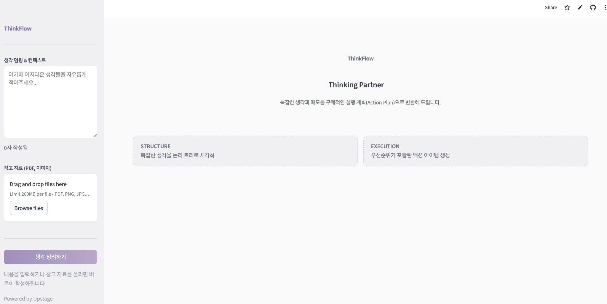

# 생각 정리를 돕는 AI 에이전트 ThinkFlow 프로젝트

메모장에 이것저것 쓰다가, 또는 쏟아지는 자료에 압도되어, 누가 딱 할 일을 정리해줬으면 좋겠다고 생각한 적 없으셨나요?! 저는 많았답니다..

이때 개인적으로 얻은 '생각 정리'의 꿀팁은, 1) 메모장에 흩어져있는 생각들의 계층을 정리 2) 메모장 속에서 액션플랜을 추출해서 일정으로 만들기 였는데, 이러면 내려다보듯 복잡한 생각들이 잘 정리되고 쉽게 할 일을 할 수 있더라고요.

그런 작업을 수행하고 싶어 만든 프로젝트 ThinkFlow는 산만한 생각과 원본 문서를 계층적 Logic Tree와 Action Plan으로 바꿔 주는 Cognitive AI Agent입니다. Upstage Solar Pro의 추론 능력과 Solo Consultant 페르소나를 사용해 학생 및 1인 작업자를 지원합니다.

---

## 1. Project Overview

사용자는 흩어진 메모, 생각, 참고 자료를 구체적인 다음 단계로 정리하는 데 어려움을 겪습니다. ThinkFlow는 이 인지적 마찰(Cognitive Friction)을 줄이기 위해, 다중 모달 입력(텍스트, PDF, 이미지)을 받아 LLM 추론으로 구조화하고, 계층적 Logic Tree와 실행 가능한 Action Plan을 생성합니다.

시스템은 처리 전에 사용자 입력에서 누락된 정보(마감일, 리소스 등)를 식별하고, 명시적으로 보완을 요청한 뒤 처리합니다.

---

## 2. Key Features

- **Context-Aware Gap Analysis:** 사용자 입력에서 목표, 마감일, 담당 등 부족한 정보를 검사하고, 처리 전에 보완을 요청합니다.

- **Multi-modal Processing:** Upstage Document Parse로 PDF·이미지에서 레이아웃 인식 텍스트를 추출하고, 사용자 텍스트와 병합합니다.

- **Logic Tree Visualization:** 추론된 구조(Goal–Strategy–Action)를 Mermaid.js로 시각화해 Streamlit 본문에 표시합니다.

- **Dynamic Action Plan:** 태스크 목록을 생성하며 dependency, priority, D-day, AI Suggestion(해당 액션 전후로 할 만한 일)을 포함합니다.

- **Condition-Based Reasoning:** 모호한 입력에서 선행 조건과 조건부 태스크를 추론합니다.

- **Strategic Comments:** 계획 하단에 “꼭 언제까지”, “빨리 진행할 것”, “생략 가능·리소스 아끼기”를 정리해 표시합니다.

- **Refinement Loop:** 사용자가 자연어로 수정·보완 요청을 보내면, 누적된 컨텍스트를 반영해 계획을 재생성합니다.

---

## 3. System Architecture

```
Input Layer          Processing Layer        Reasoning Layer           Output Layer
-------------        -----------------       -----------------          -------------
Streamlit UI    -->  Document Parse      -->  Solar Pro (LLM)      -->   Mermaid Renderer
(Text Area,           (PDF/Image OCR,         LangChain                  Logic Tree
 File Upload)         Layout Analysis)       Orchestration              Action Table
                                                                         ICS Export
                                                                         Strategic Comments
```

- **Input Layer:** Streamlit 사이드바의 텍스트 영역(생각 덤핑 & 컨텍스트)과 PDF·이미지 파일 업로드. 주 동작 버튼은 “생각 정리하기”입니다.

- **Processing Layer:** Upstage Document Parse로 업로드 파일의 OCR 및 레이아웃 분석을 수행하고, 추출 텍스트를 사용자 텍스트와 결합합니다.

- **Reasoning Layer:** Upstage Solar Pro(LLM)를 LangChain으로 조율합니다. Gap Analysis, Executive Summary, Logic Tree(Mermaid), Action Plan(JSON), Strategic Comments 각각에 대한 체인이 구성됩니다.

- **Output Layer:** 본문에 Executive Summary, Logic Tree(Mermaid.js), Action Plan(태스크·선행·마감·우선순위·액션 전후 제안), Timeline(월별·D-day·조건), Strategic Comments, ICS 캘린더 다운로드가 표시됩니다.

---

## 4. Technology Stack

- Python 3.9+
- Streamlit (Frontend)
- Upstage API (Solar Pro, Document Parse)
- LangChain (Agent Framework)
- LangChain Upstage (Document Parse Loader, Chat)
- Mermaid.js (Visualization)
- python-dotenv (Environment)
- ics (Calendar Export)

---

## 5. Getting Started

### Prerequisites

- Python 3.9 이상
- Upstage API key (Solar Pro, Document Parse)

### Installation

1. 저장소를 클론합니다.

```bash
git clone https://github.com/Mo-zZaAa/upstagedemo.git
cd upstagedemo
```

2. 가상 환경을 만들고 의존성을 설치합니다.

```bash
python -m venv venv
source venv/bin/activate   # Windows: venv\Scripts\activate
pip install -r requirements.txt
```

3. 환경 변수를 설정합니다.

프로젝트 루트에 `.env` 파일을 만들고 Upstage API key를 넣습니다. `.env`는 `.gitignore`에 포함되어 커밋되지 않습니다.

```
UPSTAGE_API_KEY=your_api_key_here
```

Streamlit Cloud에서는 앱의 Secrets에 `UPSTAGE_API_KEY`를 설정합니다.

4. 애플리케이션을 실행합니다.

```bash
streamlit run app.py
```

또는 제공된 스크립트를 사용합니다.

```bash
./run.sh
```

터미널에 표시된 URL(예: http://localhost:8501)로 접속한 뒤, 텍스트를 입력하고 필요 시 PDF·이미지를 업로드한 후 “생각 정리하기”를 눌러 Logic Tree와 Action Plan을 생성합니다.

---

## 6. Screenshot

ThinkFlow 초기 화면. 왼쪽 사이드바에 생각 덤핑·참고 자료 업로드, 본문에 Structure(Logic Tree)와 Execution(Action Plan) 플레이스홀더가 표시됩니다.



다음과 같은 형식으로 계층적으로 내용의 위계를 정리해줍니다! 단순 요약과 다르게 어느쪽으로 더 많은 생각을 하고 있는지 알 수 있습니다.


또 다음과 같은 형식으로 액션플랜이 만들어집니다. 일을 하기 전에 선행되어야할 것 등도 AI가 알아서 제안해주고, 누르면 추가해서 일을 무사히 수행할 수 있게 지원합니다. 본 일정은 수정 후 캘린더파일로 다운받아서 바로 캘린더 앱에 해당 파일을 불러오면 일정으로 소화할 수 있습니다!


---

